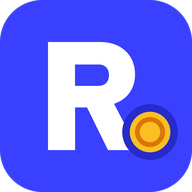

# Ardoli Tecnologia

**Ajudando negócios a venderem mais para quem já é cliente.**

---

## 👋 Sobre nós

A **Ardoli Tecnologia** é uma empresa brasileira de software focada em construir soluções para o mercado. Acreditamos que o crescimento mais sustentável de um negócio vem da própria base de clientes, e construímos ferramentas simples para transformar compradores ocasionais em clientes recorrentes.

## 🚀 Nosso produto

<table>
  <tr>
    <td width="96" align="center">
      
    </td>
    <td>
      <h3>Ryo CRM</h3>
      O CRM com cashback integrado. Cada compra gera saldo, e cada saldo é um convite para o cliente voltar.
    </td>
  </tr>
</table>

Com o Ryo CRM, empresas podem:

- 📇 **Gerenciar clientes** em um só lugar, com histórico de compras e saldo de cada um;
- 💰 **Criar regras de cashback** sob medida: percentual, validade e valor mínimo de resgate;
- 🔔 **Enviar lembretes automáticos** de saldo disponível e saldo prestes a vencer;
- 📊 **Acompanhar resultados** em tempo real: recompra, ticket médio e retorno do programa.

## 🧭 Nossos valores

- **Simplicidade** — ferramentas fáceis de usar, sem planilhas e sem complicação;
- **Resultado** — cada funcionalidade existe para gerar retorno real para o cliente;
- **Proximidade** — construímos o produto ouvindo quem usa no dia a dia.

## 📬 Contato

- 🌐 Site: [https://ryo.app.br](https://ryo.app.br)
- ✉️ E-mail: contato@ardoli.com.br

---

Feito com 💙 no Brasil pela Ardoli Tecnologia

